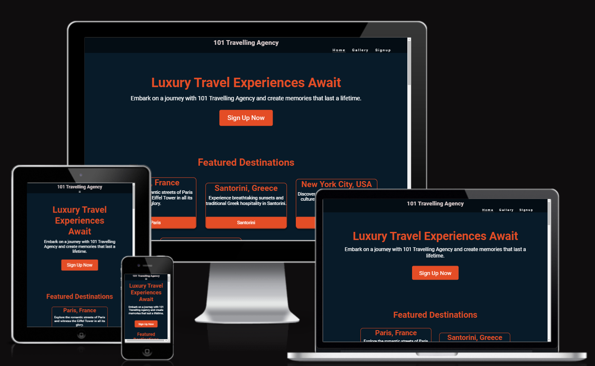
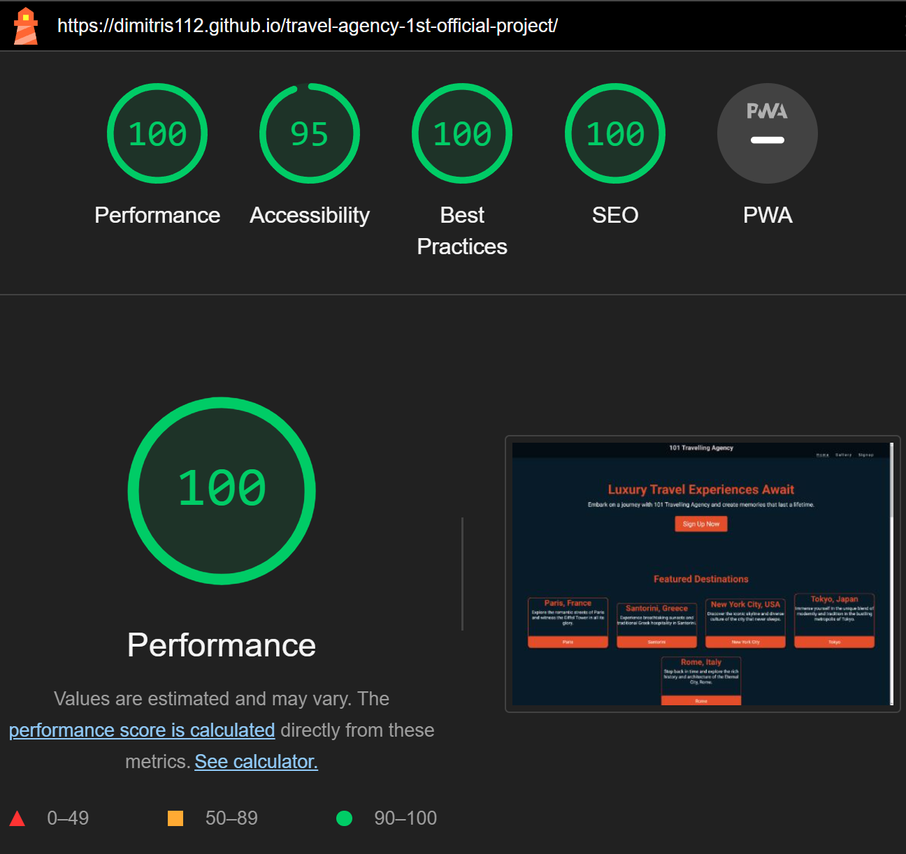
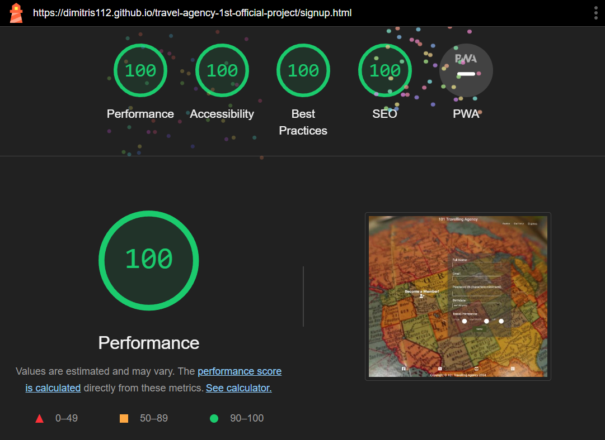
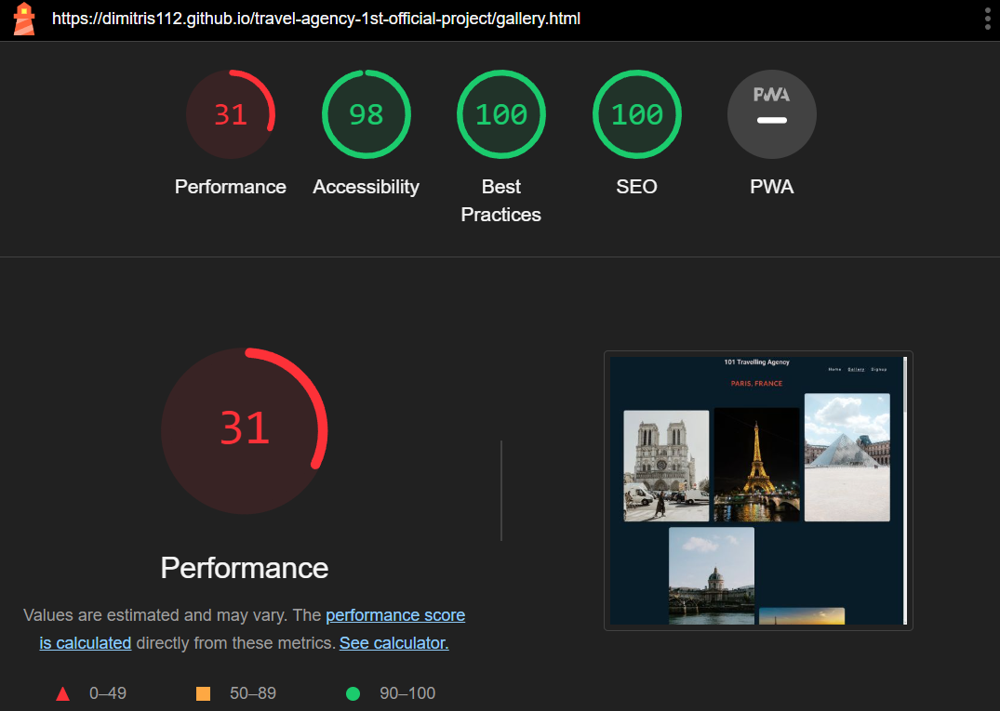
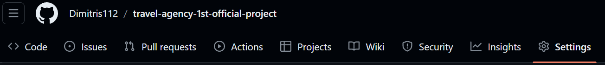
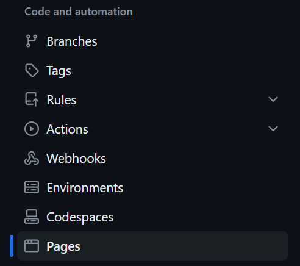
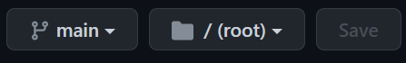

# 101 Travelling Agency
The live link can be found here - [101 Travelling Agency](https://dimitris112.github.io/travel-agency-1st-official-project/)

## Purpose of the project
The purpose of this project is to create a user-friendly and efficient platform that can manage clients, offers, bookings and being able to travel all over the globe.

## User Stories
As a visiting user, I would like to signup to 101 travelling agency to make bookings so that I can plan my trip and get discounts on flights, hotels or activities.

### Features
- User signup functionality to create an account on the website.

- Quick navigation through the gallery page using the buttons on the homepage.

- Responsive design to ensure optimal viewing experience across different devices.

#### Future Features
- Integration of a payment gateway for seamless and secure online transactions.
- Personalized recommendations based on user preferences and past bookings.
- Interactive maps and itineraries to assist users in planning their trips more effectively.

### Typography and color scheme
The project utilizes the Lato and Roboto font families for typography, providing a clean and modern aesthetic. The color scheme incorporates shades of white, dark blue, and coral, enhancing readability and visual appeal. Also used rgba coloring for the box shadows.

### Technology
- HTML: Structure of web pages.
- CSS: Styling and design of web pages, including colors and hover effects.
- JavaScript (Future Implementation): Enhancing interactivity and user experience.

### Testing
1. Code Validation
    - [HTML](https://validator.w3.org/nu/?doc=https%3A%2F%2Fdimitris112.github.io%2Ftravel-agency-1st-official-project%2F) & [CSS](https://jigsaw.w3.org/css-validator/validator?uri=https%3A%2F%2Fdimitris112.github.io%2Ftravel-agency-1st-official-project%2F&profile=css3svg&usermedium=all&warning=1&vextwarning=&lang=en) validation are both errorless.

2. Test cases
- For all metrics I used **Lighthouse** on incognito Chrome to avoid any plugins/extensions interference.
 - The **index** page passes with three 100 score and only the **Accessibility** on a 90 score. Almost the same goes for the **signup** page too but this time it's full of 100.

      

3. Fixed bugs

4. Unfixed bugs
 - Need to make the gallery page lighter.

  

5. Supported screens and browsers
    * The website will be optimized for a wide range of screen sizes and browsers, including Chrome, Firefox and Edge.

## Deployment
### via Gitpod

### via Github pages
- In the *GitHub* repository, navigate to the **Settings** tab.

- From the *Code and Automation* dropdown menu , select **Pages**.

- Once you're there , select the *branch* to be **main** and the *folder* to be **/root**. Then 
click save.

## Credtis 

- [Font Awesome](https://fontawesome.com/) for providing icons used in the project.
- [Pexels](https://www.pexels.com/) for providing the images in the gallery page and the background video for the signup form.
- [Favicon](https://favicon.io/) for generating my favicon.
- [Love Running](https://github.com/Code-Institute-Solutions/love-running-v3/tree/main/8.1-testing-and-validation) for the general idea.
- [Coders Coffeehouse](https://learn.codeinstitute.net/courses/course-v1:CodeInstitute+LRR101+2021_T1/courseware/e014c29a2ac1464f9708fdedf557e533/fb53b5df2fbd47f183297ff8c93040c1/?child=first) for providing the contact tables and the google maps iframe info.
- [AsmrProg](https://www.youtube.com/@AsmrProg) Some of his videos providing me with the idea of hover effects. 