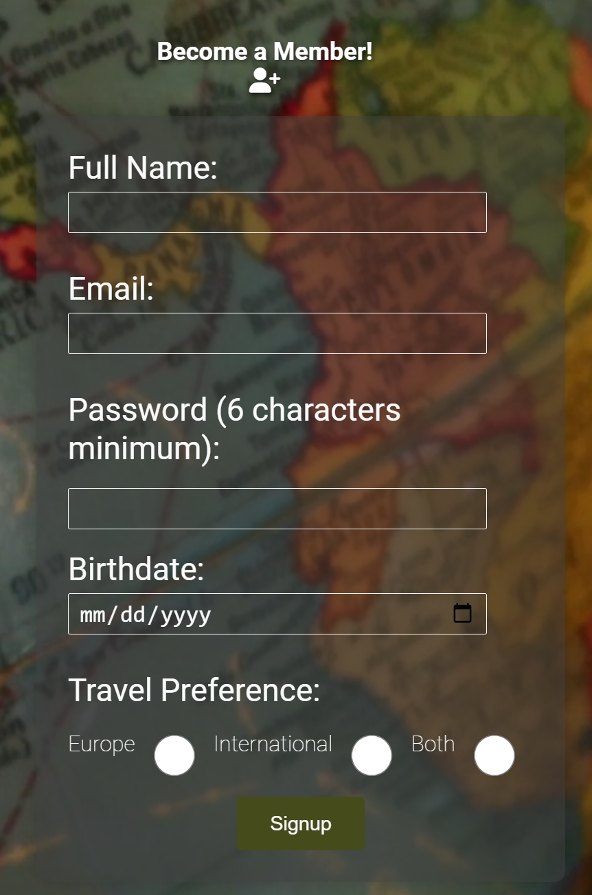
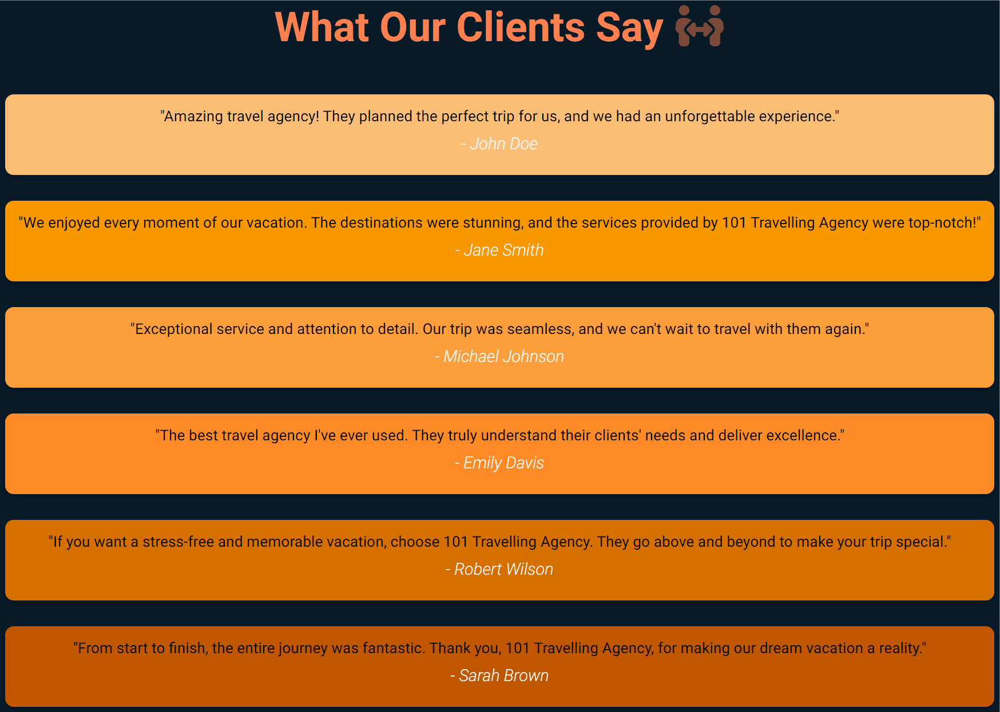
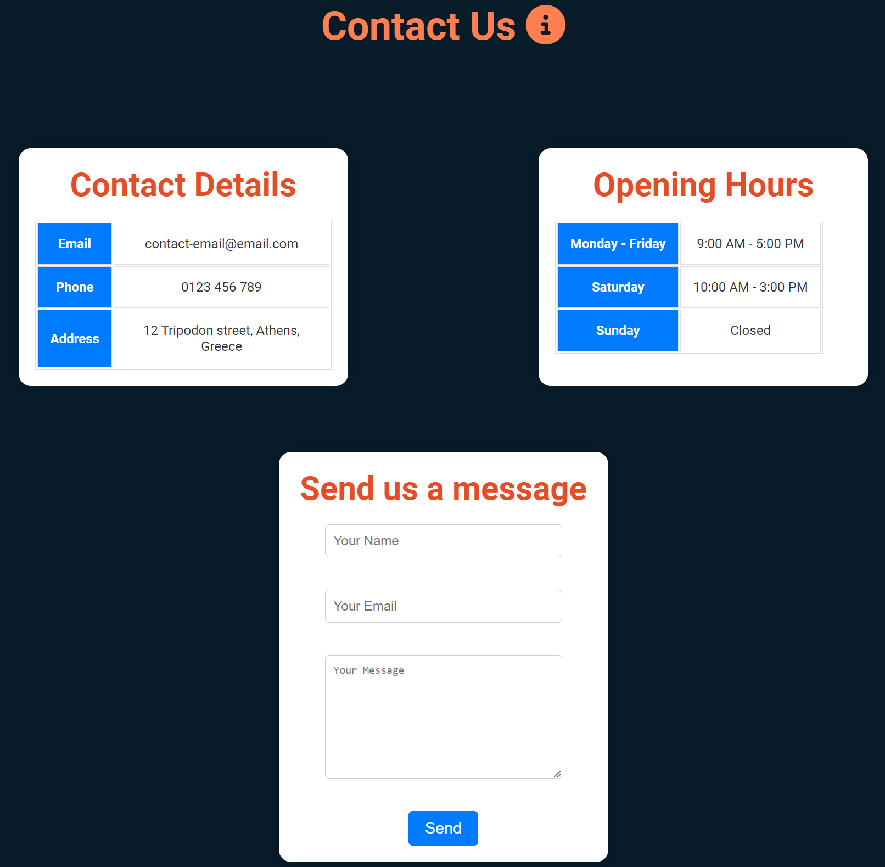
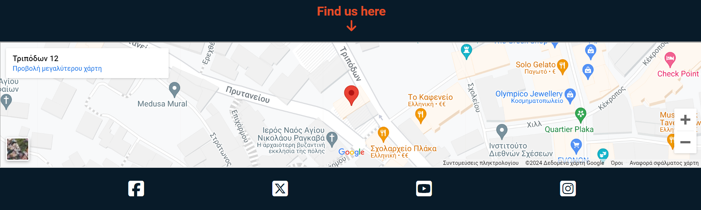

# 101 Travelling Agency

The live link can be found here - [101 Travelling Agency](https://dimitris112.github.io/travel-agency-1st-official-project/)

## Purpose of the project

The purpose of this project is to create a user-friendly and efficient platform that can manage clients, offers, bookings and being able to travel all over the globe.

## User Stories

As a visiting user, I would like to signup to 101 travelling agency to make bookings so that I can plan my trip and get discounts on flights, hotels or activities.

### Features

- User **signup** functionality to create an account on the website.

  

- Quick **navigation** through the gallery page using the **buttons** on the homepage.

- _Testimonials_ from happy customers.

  

- _Contact_ information including **address**, **phone**, **email**, **opening hours** and a send us a **message** placeholder.

  

- _Newsletter_ subscription for **updates** about new offers and special events.

  

- _Google maps_ integration to show the location of the agency and on the **footer** below our social media icons.

  

- Responsive design to ensure optimal viewing experience across different devices.

#### Future Features

- Integration of a payment gateway for seamless and secure online transactions.
- Personalized recommendations based on user preferences and past bookings.
- Interactive maps and itineraries to assist users in planning their trips more effectively.

### Typography and color scheme

The project utilizes the Lato and Roboto font families for typography, providing a clean and modern aesthetic. The color scheme incorporates shades of white, dark blue, and coral, enhancing readability and visual appeal. Also used rgba coloring for the box shadows.

### Technology

- HTML: Structure of web pages.
- CSS: Styling and design of web pages, including colors and hover effects.
- JavaScript (Future Implementation): Enhancing interactivity and user experience.

### Testing

1. Code Validation

   - [HTML](https://validator.w3.org/nu/?doc=https%3A%2F%2Fdimitris112.github.io%2Ftravel-agency-1st-official-project%2F) & [CSS](https://jigsaw.w3.org/css-validator/validator?uri=https%3A%2F%2Fdimitris112.github.io%2Ftravel-agency-1st-official-project%2F&profile=css3svg&usermedium=all&warning=1&vextwarning=&lang=en) validation are both errorless.

2. Test cases

- For all metrics I used **Lighthouse** on incognito Chrome devtools to avoid any plugins/extensions interference.
- The **index** page passes with three 100 score and only the **Accessibility** on a 90 score. Almost the same goes for the **signup** page too but this time it's full of 100.

 

3. Fixed bugs

- Fixed the erorr I had on the **Google Maps** section with having the width on 100%. My solution was adding a class above the iframe
  `
` and then styling it accordingly to my preference.
- Fixed some typos preventing me from accessing the images on the **Gallery** page according to the HTML Validator `\ and /`
- Fixed the gallery page to appear as **grid** instead of flex and have the appearnce I wanted.

4. Unfixed bugs

- Need to make the gallery page lighter.

5. Supported screens and browsers
   - The website will be optimized for a wide range of screen sizes and browsers, including Chrome, Firefox and Edge.

## Deployment

### via Github pages

- In the _GitHub_ repository, navigate to the **Settings** tab.

- From the _Code and Automation_ dropdown menu , select **Pages**.

- Once you're there , select the _branch_ to be **main** and the _folder_ to be **/root**. Then
  click save.

## Credtis

- [Font Awesome](https://fontawesome.com/) for providing icons used in the project.
- [Pexels](https://www.pexels.com/) for providing the images in the gallery page and the background video for the signup form.
- [Favicon](https://favicon.io/) for generating my favicon.
- [Love Running](https://github.com/Code-Institute-Solutions/love-running-v3/tree/main/8.1-testing-and-validation) for the general idea.
- [Coders Coffeehouse](https://learn.codeinstitute.net/courses/course-v1:CodeInstitute+LRR101+2021_T1/courseware/e014c29a2ac1464f9708fdedf557e533/fb53b5df2fbd47f183297ff8c93040c1/?child=first) for providing the contact tables and the google maps iframe info.
- [AsmrProg](https://www.youtube.com/@AsmrProg) Some of his videos providing me with the idea of hover effects.
